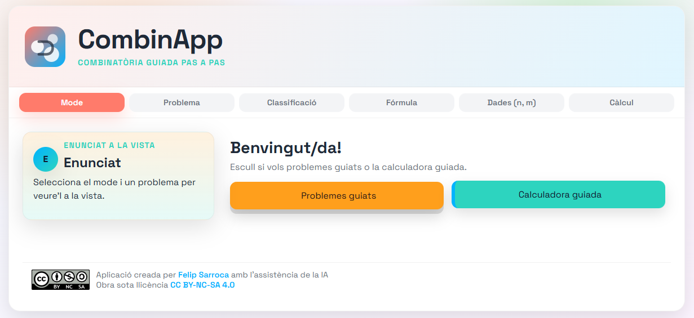
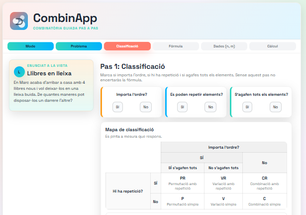
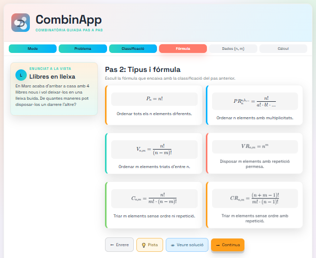

# CombinApp

Aplicació web totalment frontal per aprendre combinatòria guiada pas a pas. Guia l’alumnat en la classificació del problema, la tria de la fórmula, la identificació de n i m i el càlcul final, amb pistes i validacions en cada pantalla.

## Captures de pantalla





## Què ofereix

- Dos modes: **Mode A (Problemes guiats)** amb enunciats extrets dels JSON de `problems-*.json` i **Mode B (Calculadora guiada)** per casos lliures.
- Flux en 4 pantalles: classificació (ordre, repetició, tots), tipus i fórmula, assignació de n i m (amb multiplicitats per a permutacions amb repetició) i càlcul detallat amb explicació en llenguatge natural.
- Validacions i feedback immediat: toasts d’error, pistres i botó “Veure solució” a cada pas; comprovació de coherència (p. ex. `m > n` sense repetició o `m = n` quan s’indica “tots”).
- Panell lateral amb l’enunciat sempre visible en Mode A i barra de progrés clicable per tornar enrere sense perdre respostes.
- Fórmules renderitzades amb KaTeX i catàleg tancat de sis casos (permutacions, variacions i combinacions amb o sense repetició).

## Com executar-ho localment

1. Obre una consola a la carpeta del projecte (`I:\Mi unitat\Github\edu-apps\CombinApp`).
2. Serveix els fitxers estàtics per evitar bloquejos de `fetch` als JSON. Amb Python:
   ```bash
   python -m http.server 8000
   ```
   o amb Node:
   ```bash
   npx serve .
   ```
3. Entra a `http://localhost:8000` amb el navegador.

## Ús ràpid

- **Mode A – Problemes guiats**: tria nivell i problema, llegeix l’enunciat fix al panell i completa els 4 passos. Cada pas compara amb la solució del JSON i pots demanar pista o omplir la resposta correcta.
- **Mode B – Calculadora guiada**: introdueix n, m i les condicions; l’app dedueix tipus i fórmula vàlids, comprova incoherències i mostra el càlcul i l’explicació final.

## Fitxers principals

- `index.html`: maqueta i estructura de pantalles.
- `styles.css`: estil 3D, targetes i barra de progrés.
- `app.js`: lògica principal, validacions, renderitzat de passos i càlculs.
- `problems-facil.json`, `problems-mitja.json`, `problems-dificil.json`: banc de problemes en català.
- `Captura-1.PNG`, `Captura-2.PNG`, `Captura-3.PNG`: captures utilitzades al README.

## Format de dades dels problemes

Cada problema en els JSON segueix aquesta estructura mínima:

```json
{
  "id": "F1",
  "nivell": "Fàcil",
  "titol": "Llibres en lleixa",
  "enunciat": "…",
  "ordre": true,
  "repeticio": false,
  "tots": true,
  "n_correcte": 4,
  "m_correcte": 4,
  "tipus": "permutacio_simple",
  "formula_id": "permutacio_simple",
  "resultat": 24,
  "explicacio_final": "…",
  "pistes": { "pas1": [], "pas2": [], "pas3": [] },
  "solucions_parcials": {
    "pas1": { "ordre": true, "repeticio": false, "tots": true },
    "pas2": { "tipus": "permutacio_simple", "formula_id": "permutacio_simple" },
    "pas3": { "n": 4, "m": 4 }
  }
}
```

## Llicència

Aplicació sota llicència Creative Commons **CC BY-NC-SA 4.0**, indicada al peu de la pàgina (`CC_BY-NC-SA.svg`).
