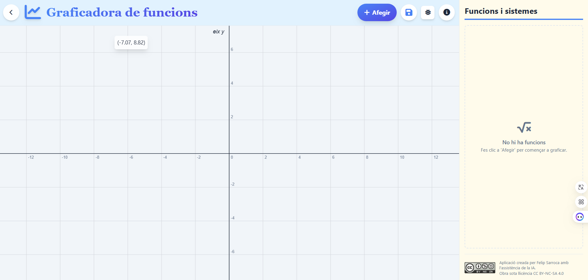

# GraphMath

GraphMath és una aplicació web dissenyada per representar gràficament funcions matemàtiques. És una eina educativa ideal per a estudiants i professors que volen visualitzar conceptes matemàtics de manera interactiva i senzilla.

## 🚀 Accés a l'aplicació

Pots utilitzar l'aplicació en directe a través del següent enllaç:

**[Obrir GraphMath](https://felipsarroca.github.io/edu-apps/GraphMath/)**

<!-- 
Recomanació: Fes una captura de pantalla de l'aplicació en funcionament, desa-la al repositori (per exemple, com a `screenshot.png`) i substitueix la línia de sota per la teva imatge.
-->

## ✨ Característiques principals

*   **Representació de funcions:** Introdueix qualsevol funció matemàtica (p. ex., `x^2`, `sin(x)`, `log(x)`) i visualitza'n el gràfic a l'instant.
*   **Interfície interactiva:** Fes zoom i desplaça't pel gràfic per explorar la funció amb detall.
*   **Visualització múltiple:** Representa diverses funcions simultàniament per comparar-les.
*   **Disseny adaptable:** L'eina funciona correctament tant en ordinadors d'escriptori com en dispositius mòbils.

## 🛠️ Tecnologies utilitzades

Aquesta aplicació està construïda amb tecnologies web modernes:

*   **HTML5:** Per a l'estructura bàsica de la pàgina.
*   **Tailwind CSS:** Per a un disseny ràpid i adaptable.
*   **JavaScript:** Per a tota la lògica de l'aplicació.
*   **D3.js:** Per a la creació i manipulació de les visualitzacions gràfiques.
*   **MathJax:** Per a la representació correcta de fórmules matemàtiques en format LaTeX.

El projecte està compilat per a producció, probablement amb una eina com **Vite**, que optimitza els fitxers per a un rendiment màxim.

## 💻 Com utilitzar en local

Si prefereixes executar l'aplicació en local:

1.  Clona o descarrega aquest repositori al teu ordinador.
2.  Obre el fitxer `index.html` directament al teu navegador web (com Chrome, Firefox o Edge).

L'aplicació es carregarà i estarà llesta per ser utilitzada sense necessitat d'instal·lar res.

## 📄 Llicència

Aquest projecte està sota la llicència MIT.

## 👨‍💻 Autor

*   **Felip Sarroca**
