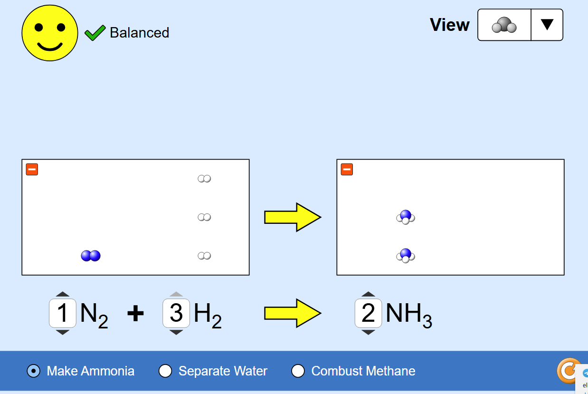

# Laboratori d'igualació d'equacions

Aplicació web interactiva per practicar l'equilibrat d'equacions químiques amb suport visual, filtres per nivells i seguiment de progressos. Dissenyada per a l'aula de secundària i batxillerat.

## Visió ràpida
- Tipus de recurs: web estàtica (HTML, CSS i JavaScript) autoallotjable a GitHub Pages.
- Públic objectiu: alumnat d'ESO i batxillerat que necessita reforçar l'igualació química.
- Què aporta: taula dinàmica d'àtoms, ajudes pas a pas, filtres per dificultat i tipologia de reaccions, i marcador d'intents que es desa al navegador.
- Requisits tècnics: només cal servir el projecte amb un servidor web estàtic (p. ex. `python -m http.server`) per permetre la càrrega dels JSON.

## Funcionalitats clau
- Biblioteca de reaccions etiquetades per tipus i nivell (`data/*.json`) amb explicacions pedagògiques.
- Filtre combinat de tipologia i dificultat, amb botó de nova equació i selector multiselecció.
- Taula d'àtoms reactius/productes amb diferències calculades en temps real.
- Modes d'ajuda: pistes guiades, solució completa, recomptes d'àtoms i representació gràfica en SVG.
- Gamificació lleugera: intents, encerts i ratxa guardats a `localStorage`.
- Interfície preparada per a MathJax i paleta de colors adaptada per a estudiants.

## Captura de pantalla


## Estructura del projecte
```text
IgualacioQuimica/
├── index.html              # Pàgina principal amb Tailwind CDN i càrrega de MathJax
├── css/
│   └── styles.css          # Estils propis (complements a Tailwind)
├── js/
│   └── app.js              # Lògica principal de l'app (gestió d'equacions, UI i estadístiques)
├── data/
│   ├── eq_basic.json       # Equacions nivell 1
│   ├── eq_intermediate.json# Equacions nivell 2
│   ├── eq_advanced.json    # Equacions nivell 3 i redox
│   ├── equations_master.json
│   └── reaction_types.json # Catalogació de reaccions
├── scripts/
│   └── update_equations.py # Script opcional per regenerar els JSON
├── favicon.svg             # Icona principal
├── CC_BY-NC-SA.svg         # Insígnia de la llicència
└── Captura.PNG             # Imatge d'exemple
```

## Execució local
### Opció 1. Servidor Python (recomanada)
1. Obrir una terminal a `IgualacioQuimica`.
2. Executar:
   ```bash
   python -m http.server 8000
   ```
3. Obriu el navegador i aneu a `http://localhost:8000`.

### Opció 2. npm serve (alternativa multiplataforma)
1. Instal·lar `serve` una sola vegada:
   ```bash
   npm install --global serve
   ```
2. Llançar el servidor:
   ```bash
   serve .
   ```
3. Visitar l'enllaç que mostri la terminal (habitualment `http://localhost:3000`).

> Nota: si obriu `index.html` directament amb `file://`, el navegador bloquejarà la càrrega dels fitxers JSON. Sempre cal un servidor local.

## Flux de treball docent suggerit
- **Activació**: trieu el tipus de reacció i el nivell segons els objectius de la sessió.
- **Modelatge**: projecte la pantalla, activeu les pistes i mostreu com es dedueixen els coeficients.
- **Treball autònom**: demaneu a l'alumnat que treballi per parelles; poden registrar els seus intents i encerts.
- **Extensions**: utilitzeu `equations_master.json` per preparar reptes o tasques a Google Classroom. Podeu exportar els resultats del marcador demanant una captura o transcripció manual.

## Gestió de dades i personalització
- **Afegir reaccions**: editeu `data/eq_basic.json`, `data/eq_intermediate.json` o `data/eq_advanced.json`. Mantenir l'estructura (`reactants`, `products`, `coefficients`, `type`, `level`, `explanation`).
- **Script de suport**: `scripts/update_equations.py` genera els JSON a partir de llistes Python. Ideal si preferiu editar les dades des d'un mateix arxiu.
  ```bash
  python scripts/update_equations.py
  ```
- **Tipologies de reacció**: `data/reaction_types.json` controla les etiquetes visibles al filtre i a la interfície.
- **Traduccions**: tot el text es troba a `index.html` i `js/app.js`. Els literals de les dades són en català per defecte.

## Scripts disponibles
- `scripts/update_equations.py`: requereix Python 3. Escriu tots els fitxers JSON a `data/` amb format UTF-8 i indentació de 2 espais.

## Tecnologies utilitzades
- HTML5 i Tailwind CSS (CDN) per a la interfície.
- JavaScript modular (`type="module"`) per encapsular lògica i estat.
- MathJax 3 (CDN) per renderitzar fórmules químiques i símbols.
- SVG generat en temps real per visualitzar molècules i àtoms.
- `localStorage` per mantenir intents/encerts entre sessions.

## Millores pendents (idees)
- Afegir mode redox pas a pas amb descomposició d'ions i càrregues.
- Exportació d'estadístiques en CSV o Google Sheets mitjançant scripts externs.
- Suport multilingüe (castellà i anglès) amb fitxers de traducció.
- Modalitat de qüestionari cronometrat amb taula de classificació.

## Llicència
El codi i els materials es distribueixen sota llicència [Creative Commons BY-NC-SA 4.0](https://creativecommons.org/licenses/by-nc-sa/4.0/deed.ca).

## Crèdits
Projecte creat per Felip Sarroca amb assistència de la IA. Accedeix als repositoris educatius des de `I:\Mi unitat\Github` per mantenir una còpia organitzada dels materials.

