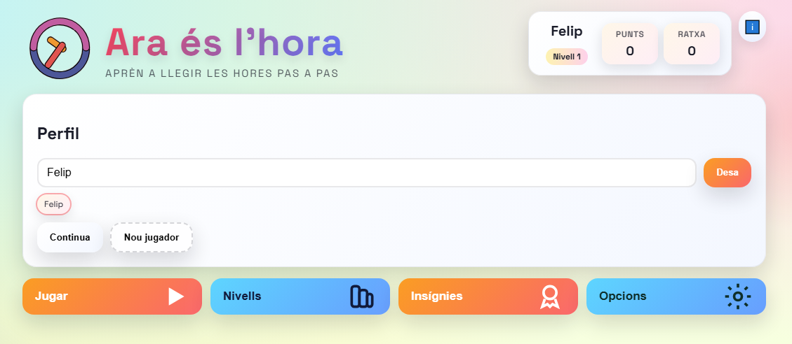
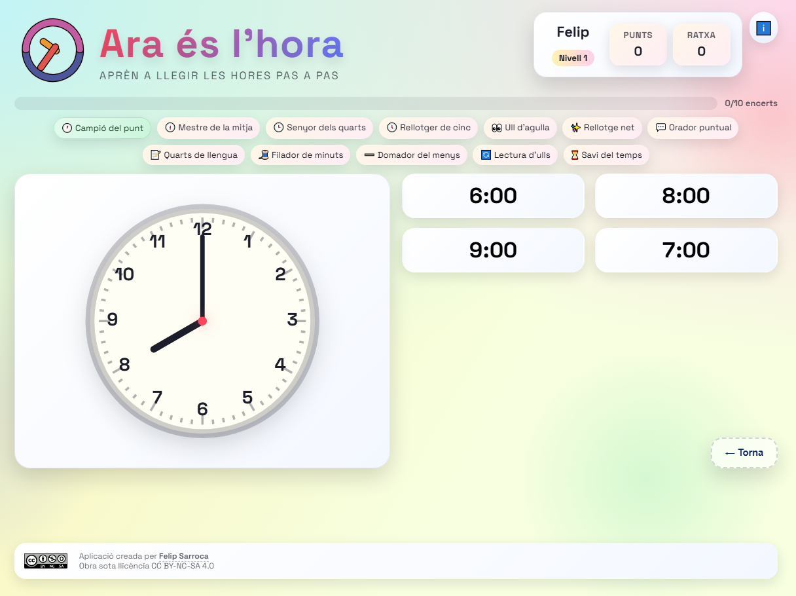
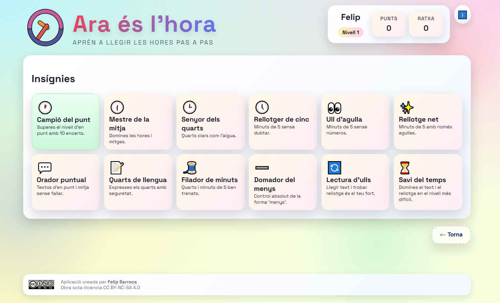

# Les hores

## Què és
Aplicació web (HTML, CSS i JavaScript) per aprendre a llegir i expressar l'hora amb nivells progressius, gamificació i un disseny pensat per a aula. Funciona sense instal·lació ni build: obres `index.html` i ja pots jugar.

## Enllaços
- https://felipsarroca.github.io/edu-apps/LesHores/
- https://ja.cat/araeslhora

## Característiques clau
- Nivells graduals (en punt, mitja, quarts, minuts de 5, forma "menys").
- Modes de joc amb rellotge analògic, text i opcions.
- Perfils de jugador amb progrés guardat.
- Insígnies i punts per motivar.
- Disseny responsive amb mode ordinador i mode mòbil.
- Tema clar/fosc i opció de so.
- Pensada per instal·lar-se com a app al mòbil.

## Com s'utilitza
1. Obre `index.html` amb el navegador.
2. Escriu el nom del jugador i prem "Desa".
3. Entra a "Jugar" o "Nivells" i comença.
4. El progrés queda guardat automàticament al navegador.

Si vols evitar problemes de memòria cau, pots fer un hard refresh (Ctrl+F5) després de canvis.

## Instal·lació com a app (PWA)
### Android (Chrome)
1. Obre https://ja.cat/araeslhora al mòbil.
2. Toca el menú (⋮) i tria "Afegeix a la pantalla d'inici".
3. Confirma i obre l'app des de la icona.

### iPhone / iPad (Safari)
1. Obre https://ja.cat/araeslhora amb Safari.
2. Toca "Compartir" i tria "Afegir a la pantalla d'inici".
3. Confirma i obre l'app des de la icona.

## Configuració dins l'app
- So: activable/desactivable des d'"Opcions".
- Tema: clar o fosc.
- Pantalla: mode ordinador o mode mòbil (canvia el layout).

## Nivells (resum)
- En punt i mitja.
- Quarts.
- Minuts de 5 (amb variants sense números i sense marques).
- Frases en català (quarts, minuts de 5 i forma "menys").
- Text → rellotge (tria el rellotge correcte).

## Dades i fitxers principals
- `index.html`: estructura de la interfície.
- `styles.css`: estil visual i responsive.
- `app.js` i `engine.js`: lògica de joc i render.
- `levels.json`: definició de nivells.
- `time_bank.json`: banc d'hores i etiquetes.
- `badges.json`: insígnies i condicions.
- `manifest.json`: dades PWA.

## Captures

## Crèdits i llicència
- Aplicació creada per Felip Sarroca.
- Obra sota llicència CC BY-NC-SA 4.0.
