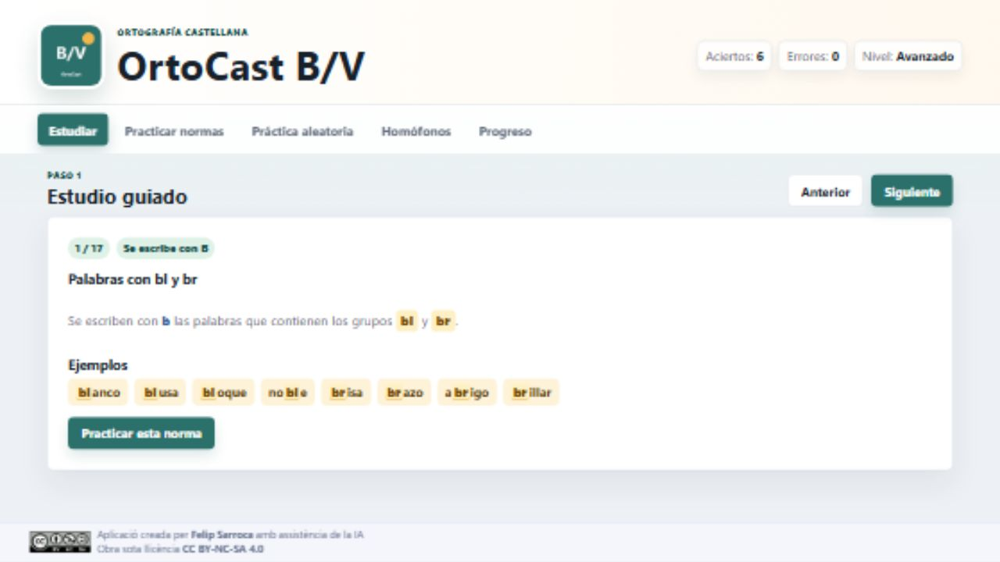
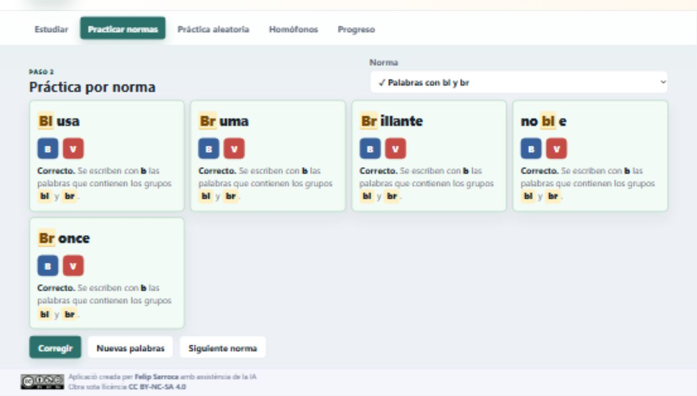
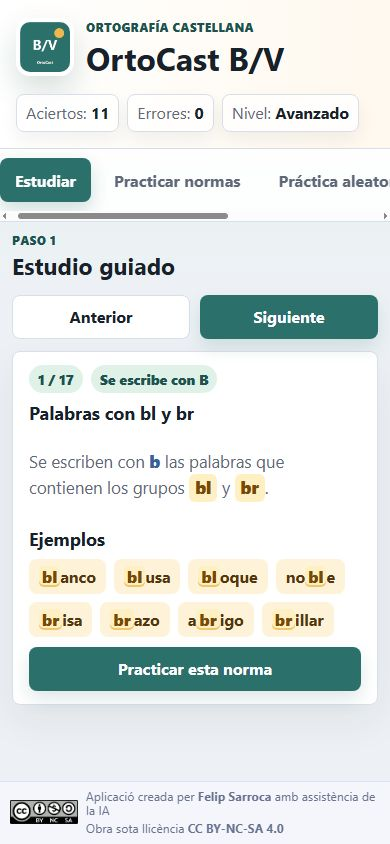

# OrtoCast B/V

Aplicación web estática para estudiar, practicar y reforzar el uso de la **B** y la **V** en castellano.

La app está pensada para un uso sencillo en el aula o en casa: primero presenta la norma con ejemplos, después propone ejercicios autocorregibles y finalmente ofrece práctica aleatoria adaptativa.

## Capturas de pantalla

### Pantalla de estudio



### Práctica con corrección visual



### Vista móvil



## Cómo abrirla en local

Desde esta carpeta, ejecuta:

```powershell
python -m http.server 8017
```

Después abre:

```text
http://localhost:8017
```

No conviene abrir directamente `index.html` con doble clic, porque la app carga datos desde archivos JSON y necesita un pequeño servidor local.

## Cómo instalarla en móvil

La app está preparada como PWA, es decir, puede instalarse en el móvil como si fuera una aplicación.

1. Abre la app desde un navegador móvil.
2. En Android/Chrome, usa `Instalar app` o `Añadir a pantalla de inicio`.
3. En iPhone/Safari, pulsa `Compartir` y después `Añadir a pantalla de inicio`.

Archivos PWA incluidos:

- `manifest.webmanifest`
- `sw.js`
- `assets/icon-192.png`
- `assets/icon-512.png`

## Qué incluye

- Estudio guiado de normas de uso de la B y la V.
- Ejemplos con la parte normativa resaltada.
- Práctica por norma.
- Botón `Nuevas palabras`, evitando repetir la misma tanda.
- Botón `Siguiente norma`.
- Corrección inmediata con explicación.
- Resaltado visual de la norma dentro de la palabra corregida.
- Selector de normas con estado por colores:
  - verde: norma completada sin fallos;
  - naranja: norma completada con 1 o 2 fallos;
  - rojo: norma completada con más de 2 fallos.
- Práctica aleatoria adaptativa.
- Repaso de errores con palabras falladas anteriormente.
- Homófonos contextualizados.
- Registro de aciertos, errores y errores frecuentes.
- Banco ampliado de datos: 18 normas, más de 250 palabras y más de 35 frases de homófonos.

## Estructura del proyecto

```text
OrtoCast-ByV/
├─ index.html
├─ styles.css
├─ app.js
├─ manifest.webmanifest
├─ sw.js
├─ data/
│  ├─ rules.json
│  ├─ words.json
│  └─ homophones.json
└─ assets/
   ├─ icon-192.png
   ├─ icon-512.png
   ├─ CC_BY-NC-SA.png
   └─ screenshots/
```

## Cómo duplicar la app para otras normas ortográficas

La app puede reutilizarse para otros contenidos: `g/j`, `ll/y`, `h`, acentuación, mayúsculas, signos de puntuación, etc.

Pasos recomendados:

1. Duplica la carpeta completa.
2. Cambia el nombre de la app en `index.html`, `manifest.webmanifest` y, si quieres, en los iconos.
3. Sustituye `data/rules.json` por las nuevas normas.
4. Sustituye `data/words.json` por las nuevas palabras o frases incompletas.
5. Si hay palabras homófonas o de significado contextual, adapta `data/homophones.json`.
6. En `app.js`, revisa la función `highlightNorm()` para indicar qué parte de cada palabra debe resaltarse en cada norma.
7. Cambia las versiones `?v=visual8` y el nombre de caché en `sw.js` cuando publiques cambios, para evitar que el móvil conserve archivos antiguos.

Ejemplo para una app de `g/j`:

```json
{
  "id": "g-geo-gen",
  "letter": "g",
  "title": "Palabras con geo-, gen- y gest-",
  "summary": "Se escriben con g muchas palabras que empiezan por geo-, gen- y gest-.",
  "examples": ["geografía", "generoso", "gesto"],
  "exceptions": []
}
```

Y una palabra de práctica:

```json
{
  "id": "gj001",
  "word": "geografía",
  "masked": "_eografía",
  "answer": "g",
  "ruleId": "g-geo-gen",
  "difficulty": 1
}
```

## Principios bayesianos de la app

La práctica aleatoria no elige palabras solo al azar. Mantiene una estimación del nivel del alumno mediante tres hipótesis:

- `Inicial`
- `Intermedio`
- `Avanzado`

Al principio, si no hay información previa, las tres hipótesis tienen la misma probabilidad:

```text
Inicial: 1/3
Intermedio: 1/3
Avanzado: 1/3
```

Después de cada respuesta, la app actualiza esa distribución. Si el alumno acierta una palabra difícil, sube la probabilidad de niveles altos. Si falla una palabra sencilla, sube la probabilidad de niveles bajos.

La actualización sigue esta idea:

```text
posterior = prior × verosimilitud
```

Después se normalizan los valores para que las probabilidades vuelvan a sumar 1.

## Modelo IRT usado

Para estimar la probabilidad de acierto se usa una versión sencilla del modelo IRT 3PL:

```text
P(acierto | nivel, pregunta) =
c + (1 - c) / (1 + exp(-a × (theta - dificultad)))
```

Valores usados:

- `theta`: nivel estimado del alumno.
- `dificultad`: dificultad de la palabra.
- `a = 1.5`: discriminación de la pregunta.
- `c = 0.5`: probabilidad de acierto por azar, porque hay dos opciones: B o V.

## Principio de Shannon

La app también usa una idea de la teoría de la información de Shannon: la **entropía**.

La entropía mide la incertidumbre. Si la app no sabe si el alumno está en nivel inicial, intermedio o avanzado, la entropía es alta. Si una hipótesis es muy probable, la entropía baja.

La práctica adaptativa intenta escoger preguntas que aporten información. Es decir, preguntas que ayuden a reducir la incertidumbre sobre el nivel real del alumno.

Por eso la app prioriza:

- normas donde ha habido más errores;
- palabras de dificultad adecuada al nivel estimado;
- preguntas que pueden diferenciar mejor entre niveles;
- errores recientes, para reforzarlos más a menudo.
- excepciones ortográficas de manera progresiva: pocas o ninguna al inicio, más en niveles intermedios y avanzados.

## Uso pedagógico recomendado

1. Empezar por `Estudiar`.
2. Leer una norma y observar los ejemplos resaltados.
3. Pulsar `Practicar esta norma`.
4. Completar la tanda.
5. Revisar las explicaciones y los resaltados de la corrección.
6. Usar `Nuevas palabras` si se quiere más práctica de la misma norma.
7. Usar `Siguiente norma` para avanzar.
8. Terminar con `Práctica aleatoria`.
9. Revisar `Progreso` para detectar normas que necesitan refuerzo.

## Autoría y licencia

Aplicación creada por Felip Sarroca con asistencia de la IA.

Obra bajo licencia `CC BY-NC-SA 4.0`.
